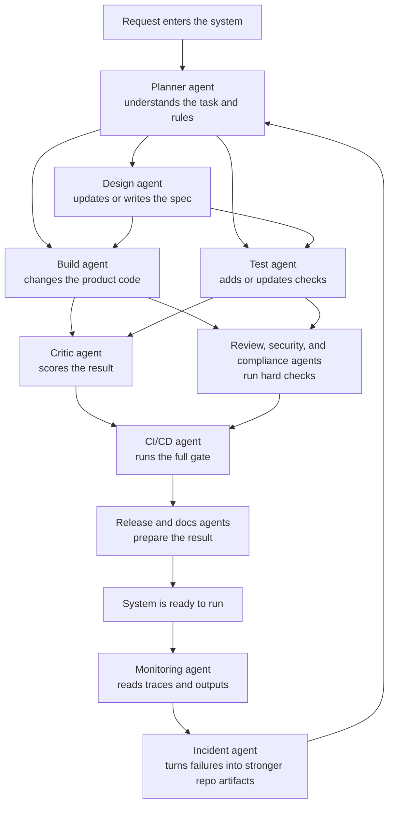

# TechTorch Agent Architecture Showcase

This repository is a plain, working example of how to organize software so AI
agents can contribute safely.

The app itself is intentionally small. It is just a web service that returns a
greeting. The real purpose of the repo is to show the **surrounding system**
that makes agent-driven development easier to understand, easier to validate,
and easier to trust.

## What This Repo Is Showing

Many people focus only on the model when they think about AI coding. This repo
shows a different idea:

- the model is only one part of the system
- the repo needs clear instructions
- the work needs checks and quality gates
- the agent flow should be visible
- failures should improve the system over time

In short, this repo is less about "AI writes code" and more about
"teams design an environment where AI can work well."

## The Main Idea In One Line

```text
Agent = Model + Harness
```

Here is what that means in simple terms:

- The **model** does the reasoning and generation.
- The **harness** is the support system around it.
- The harness includes instructions, specs, tests, evals, rules, workflow
  steps, and trace outputs.

If you remove the harness, you just have generated output.
If you keep the harness, you get a process that can be reviewed and repeated.

## Why The App Is Small

The app is small on purpose.

This helps readers focus on the structure around the app instead of getting
lost in business logic. Because the product is so simple, it is easy to see
what each supporting layer is doing.

The app:

- accepts a name
- accepts a language
- returns a greeting in English, Spanish, or French

That is enough to demonstrate specs, tests, evals, orchestration, and incident
feedback without adding unnecessary complexity.

## End-To-End Flow

The diagram below shows the full pipeline from request to feedback.



The flow works like this:

1. A request comes in.
2. The planner reads the repo guidance and breaks the work down.
3. The design agent defines the expected behavior in a spec.
4. The build agent updates the code.
5. The test agent updates the checks.
6. The critic and review layers examine the result.
7. CI runs the same gate in a repeatable way.
8. The system records what happened.
9. If something goes wrong, the repo learns from it by adding stronger future
   checks.

## How To Read This Repo

If you are new to this kind of architecture, read the repo in this order:

1. `AGENTS.md`
   This is the main set of instructions for an agent entering the repo.
2. `docs/architecture/overview.md`
   This gives the high-level picture.
3. `docs/specs/001-hello-endpoint.md`
   This shows how expected behavior is written down.
4. `src/`
   This is the small product itself.
5. `tests/` and `evals/`
   These show how the repo proves the behavior.
6. `harness/control/` and `harness/observability/`
   These show how the agent workflow is run and recorded.

## Repository Shape

```text
greeting-service/
├── AGENTS.md
├── README.md
├── docs/
├── src/
├── tests/
├── evals/
├── harness/
├── .claude/
└── .github/workflows/
```

Each folder has a different job:

- `docs/` explains what the system is meant to do
- `src/` contains the app code
- `tests/` checks the behavior directly
- `evals/` measures quality using reusable cases and rubrics
- `harness/` contains the rules, control flow, and observability
- `.claude/` stores reusable task-specific instructions
- `.github/workflows/` runs the same checks in automation

## Quick Start

### Run The Service

```bash
cd greeting-service
python3 -m src.main
```

Then open this URL:

```text
http://127.0.0.1:8000/hello?name=Workshop&lang=fr
```

You should get a JSON response with a greeting.

### Run The Full Local Gate

```bash
cd greeting-service
./harness/tools/sandboxes/test_runner.sh
```

This command runs the important checks together. It checks:

- does the code follow the architecture rules?
- do the tests pass?
- do the eval cases still pass?
- do the documented invariants still point to real checks?

### Run The Live Showcase Pipeline

Happy path:

```bash
cd greeting-service
./harness/tools/sandboxes/run_showcase_pipeline.sh --scenario happy
```

Incident feedback path:

```bash
cd greeting-service
./harness/tools/sandboxes/run_showcase_pipeline.sh --scenario incident
```

Incident feedback path, with artifacts written back into the repo:

```bash
cd greeting-service
./harness/tools/sandboxes/run_showcase_pipeline.sh --scenario incident --apply-incident-learning
```

These runs are useful because they do not just execute code. They also show the
sequence of agent stages and the files those stages depend on.

## What Gets Created When You Run Things

- `evals/results/latest_spec_compliance.json`
  The latest scoring result for the spec compliance dataset.
- `harness/observability/showcase_runs/latest_pipeline_trace.json`
  A machine-readable log of the pipeline steps.
- `harness/observability/showcase_runs/latest_pipeline_summary.md`
  A simpler summary of the same pipeline run.
- `harness/control/generated/latest_incident_bundle.json`
  A package of "what the repo should learn" from an incident scenario.

These outputs are important because they make the workflow visible. Instead of
guessing what happened, you can inspect the artifacts directly.

## Architecture Guide

### 1. Root Guides

These are the first files that explain how the repo should be used.

| File | Purpose |
| --- | --- |
| `AGENTS.md` | The main instruction sheet for any agent working in the repo. It explains the project purpose, the rules, and when to stop and ask a human. |
| `CLAUDE.md` | A compatibility file that points back to `AGENTS.md`, so different tools can find the same instructions. |
| `README.md` | The human-friendly overview you are reading now. |

### 2. Documentation Layer

This layer explains intent, constraints, and operating rules.

| Path | Purpose |
| --- | --- |
| `docs/architecture/overview.md` | A simple map of how the repo is organized and why the pieces exist. |
| `docs/architecture/invariants.md` | A short list of things that must always stay true, such as valid JSON output and no outbound network calls in app code. |
| `docs/architecture/multi-agent-orchestration.md` | A human-readable description of how the specialized agents work together. |
| `docs/architecture/integrated_pipeline_agents_tied_to_repo.svg` | A visual version of the architecture for presentations or quick review. |
| `docs/architecture/decisions/0001-use-python-stdlib.md` | Explains why the repo stays lightweight and avoids extra dependencies. |
| `docs/architecture/decisions/0002-no-outbound-network.md` | Explains why the service code is not allowed to make network calls. |
| `docs/architecture/decisions/0003-guides-and-sensors-first.md` | Explains why a change is not complete until the guidance and checks are updated too. |
| `docs/specs/template.md` | A starter template for writing future specs in a consistent way. |
| `docs/specs/001-hello-endpoint.md` | The active feature spec for the greeting endpoint. It says what the service should do and what checks must exist. |
| `docs/runbooks/deploy.md` | Step-by-step instructions for running or validating the service. |
| `docs/runbooks/rollback.md` | Step-by-step instructions for safely undoing a bad change. |
| `docs/validation/traceability-matrix.md` | A map that links intended behavior to the checks that prove it. |

### 3. Product Code

This is the actual application.

| File | Purpose |
| --- | --- |
| `src/main.py` | Starts the HTTP server and routes incoming requests. |
| `src/greeter.py` | Contains the main business rules, validation, and response-building logic. |
| `src/formats.py` | Stores the greeting text for each supported language. |
| `src/__init__.py` | Marks the folder as a Python package. |

### 4. Test Layer

These files prove that the app still behaves correctly.

| File | Purpose |
| --- | --- |
| `tests/unit/test_formats.py` | Checks that greeting templates and supported languages behave as expected. |
| `tests/unit/test_greeter.py` | Checks the main greeting rules, including defaults, trimming, and error handling. |
| `tests/unit/test_showcase_pipeline.py` | Checks that the pipeline manifest loads correctly and that the incident bundle logic works safely. |
| `tests/unit/test_llm_judge.py` | Checks the small offline critic helper used in the showcase. |
| `tests/integration/test_endpoint.py` | Starts the service and tests it like a real caller would. |
| `tests/properties/test_invariants.py` | Checks general rules that should always hold true, such as valid UTF-8 JSON output. |

### 5. Eval Layer

Tests usually check correctness directly. Evals are used here as an extra,
reusable measurement layer.

| File | Purpose |
| --- | --- |
| `evals/datasets/spec_compliance.jsonl` | A list of example inputs and expected outputs used to score whether the service still matches the spec. |
| `evals/datasets/regression_cases.jsonl` | Cases that represent failures or risky edge cases we want to protect against in the future. |
| `evals/datasets/code_quality.jsonl` | Extra examples used to think about quality-related review scenarios. |
| `evals/rubrics/code_review.md` | The review criteria used by the critic layer. |
| `evals/rubrics/spec_compliance.md` | Explains how spec compliance is measured and what score is required to pass. |
| `evals/runners/rubric_eval.py` | Runs the spec compliance dataset against the current code. |
| `evals/runners/llm_judge.py` | Builds a simple review packet from the rubric and eval results so the critic stage has a structured output. |
| `evals/results/.gitkeep` | Keeps the results folder in version control even when it is empty. |

### 6. Harness Layer

This is the part that turns a small app into an agent-ready environment.

#### Control Plane

The control plane describes the agent workflow and runs it.

| File | Purpose |
| --- | --- |
| `harness/control/orchestration.yaml` | A machine-readable description of which agent reads which files, writes which files, and passes work to whom next. |
| `harness/control/run_showcase_pipeline.py` | A runnable script that walks through the agent stages and records what happened. |
| `harness/control/README.md` | A short explanation of the control-plane folder. |
| `harness/control/generated/.gitkeep` | Keeps the generated folder in version control. |

#### Guides

Guides tell agents what they should do before they take action.

| File | Purpose |
| --- | --- |
| `harness/guides/README.md` | Explains the idea of repo guides and points readers to the main guide files. |

#### Sensors

Sensors are checks that look at the result after work has been done.

| File | Purpose |
| --- | --- |
| `harness/sensors/linters/architectural_rules.py` | Blocks changes that break hard architectural rules, such as forbidden network imports. |
| `harness/sensors/linters/doc_sync_check.py` | Makes sure shipped specs are structured correctly and still have matching eval coverage. |
| `harness/sensors/linters/skill_validator.py` | Checks that skill files have the required frontmatter and basic structure. |
| `harness/sensors/drift_detectors/invariant_check.py` | Checks that every declared invariant still points to a real enforcement artifact. |
| `harness/sensors/review_agents/architectural_reviewer.md` | A simple review checklist for architecture-focused review. |

#### Observability

Observability means "what can we inspect after a run?"

| File | Purpose |
| --- | --- |
| `harness/observability/logs_config.yaml` | Describes the logging setup for the showcase. |
| `harness/observability/trace_schema.json` | Defines the expected shape of a pipeline trace file. |
| `harness/observability/showcase_runs/.gitkeep` | Keeps the trace output directory in version control. |

#### Tools

These are helper entrypoints and tool contracts used by the harness.

| File | Purpose |
| --- | --- |
| `harness/tools/sandboxes/test_runner.sh` | Runs the main local validation sequence in one command. |
| `harness/tools/sandboxes/run_showcase_pipeline.sh` | Starts the live multi-agent showcase flow. |
| `harness/tools/mcp_servers/repo_tools/README.md` | Describes what a repo-aware MCP tool server would be expected to provide. |
| `harness/tools/mcp_servers/observability/README.md` | Describes what an observability MCP tool server would be expected to provide. |

### 7. Skills Layer

Skills are focused instruction packs for common tasks.

| File | Purpose |
| --- | --- |
| `.claude/skills/add-feature/SKILL.md` | Explains the correct process for adding or extending behavior. |
| `.claude/skills/add-feature/CHECKLIST.md` | Lists what must be true before a feature change is considered complete. |
| `.claude/skills/add-feature/examples/reference-pr.md` | Shows what a well-shaped feature change should include. |
| `.claude/skills/fix-bug/SKILL.md` | Explains the preferred process for bug fixes. |
| `.claude/skills/update-docs/SKILL.md` | Explains how to update docs without breaking traceability. |
| `.claude/skills/write-test/SKILL.md` | Explains how to add tests in a focused and useful way. |
| `.claude/commands/review-pr.md` | Reusable review instructions. |
| `.claude/commands/run-evals.md` | Reusable eval command reference. |

### 8. CI Layer

These workflows repeat the important checks automatically.

| File | Purpose |
| --- | --- |
| `.github/workflows/ci.yml` | Runs the main pull request checks. |
| `.github/workflows/eval_gate.yml` | Runs the eval layer as an explicit workflow. |
| `.github/workflows/nightly_drift.yml` | Runs drift detection on a schedule. |

### 9. Repository Infrastructure

These files support packaging and repo hygiene.

| File | Purpose |
| --- | --- |
| `pyproject.toml` | Stores packaging metadata and command entrypoints. |
| `.gitignore` | Prevents generated or unnecessary files from being committed accidentally. |
| `.env.example` | Shows the environment variable pattern the repo expects. |

## How The Pieces Work Together

### Guides

Guides explain intent before work begins.

Examples:

- `AGENTS.md` tells an agent how to behave in this repo
- `docs/specs/` tells the system what the feature should do
- `docs/architecture/` explains what must stay stable
- `.claude/skills/` gives focused task instructions when needed

### Sensors

Sensors check the result after work happens.

Examples:

- `tests/` check that behavior still works
- `evals/` score reusable examples
- `harness/sensors/` block rule violations and drift
- `.github/workflows/` rerun the same checks in automation

### Control Plane

The control plane explains the flow between specialized agents.

It answers:

- who does what
- which files they rely on
- what happens next
- where the trace gets written

The main files are:

- `harness/control/orchestration.yaml`
- `harness/control/run_showcase_pipeline.py`
- `docs/architecture/multi-agent-orchestration.md`

## Suggested Walkthrough

If you are showing this repo to someone else, this is a simple order that works
well:

1. Start with `AGENTS.md` so people see the basic rules.
2. Open `docs/architecture/overview.md` for the big picture.
3. Open `docs/specs/001-hello-endpoint.md` so the expected behavior is clear.
4. Show `src/` so people can see the tiny app.
5. Show `tests/`, `evals/`, and `harness/sensors/` so they can see how the app
   is checked.
6. Run `./harness/tools/sandboxes/run_showcase_pipeline.sh --scenario happy`.
7. Open `harness/observability/showcase_runs/` to show the trace and summary.
8. Run the incident scenario to show how the repo learns from failure.

## Design Principles

- **Rules should be enforced in code where possible.**
  It is better to block a bad change with a real check than to rely on a prompt
  that says "please do not do this."
- **Specs should come before implementation.**
  The expected behavior should be written down clearly before code changes are
  made.
- **Validation should happen continuously.**
  Good checks should run throughout the workflow, not only at the end.
- **Workflows should be visible.**
  If multiple agents are involved, their flow should be represented in the repo
  and not hidden inside a tool.
- **Failures should improve the system.**
  A good team does not only fix the bug. It also improves the harness so the
  same type of mistake is less likely next time.

## Visual Assets

- Flow and orchestration explanation:
  `docs/architecture/multi-agent-orchestration.md`
- SVG visual:
  `docs/architecture/integrated_pipeline_agents_tied_to_repo.svg`

## Final Takeaway

This repository is designed to be understandable without special background
knowledge.

The product is small on purpose.
The rules are stored in the repo.
The checks are runnable.
The workflow is visible.
The outputs are inspectable.

That is the core message of the showcase.
