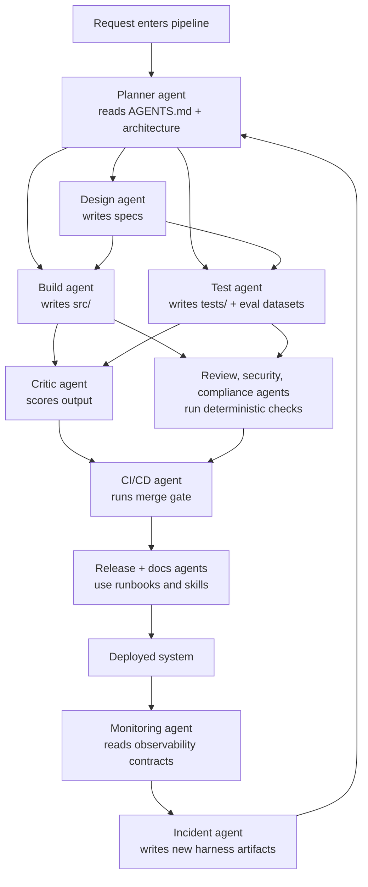

# TechTorch Agent Architecture Showcase

This repository is a compact reference implementation of an AI-native software
delivery environment. The application itself is intentionally small: a simple
HTTP greeting service. The value of the repository is the surrounding harness:
the guides, specs, sensors, evals, orchestration, and observability that make
specialized agents safe to use in a continuous development loop.

## What This Repository Shows

- How project intent is encoded as repo-native guides rather than informal
  tribal knowledge.
- How deterministic sensors and probabilistic evals work together.
- How multi-agent orchestration can be represented directly in version control.
- How failures can be converted into durable infrastructure instead of prompt
  tweaks.

## Core Model

```text
Agent = Model + Harness
```

- The model reasons.
- The harness provides context, constraints, control flow, validation, and
  feedback.
- The repository stores both the product and the operating environment that
  governs how agents work on the product.

## End-to-End Flow



## Repository Layers

```text
greeting-service/
├── AGENTS.md
├── README.md
├── docs/
├── src/
├── tests/
├── evals/
├── harness/
├── .claude/
└── .github/workflows/
```

- `AGENTS.md`: root operating guide for any agent entering the repository.
- `docs/`: architecture, specs, runbooks, validation mappings, and diagrams.
- `src/`: the product code.
- `tests/`: unit, integration, and invariant checks.
- `evals/`: datasets, rubrics, runners, and results.
- `harness/`: control plane, sensors, observability, and execution scripts.
- `.claude/`: progressive-disclosure skills and reusable commands.
- `.github/workflows/`: CI and scheduled validation entrypoints.

## Quick Start

### Run the Service

```bash
cd greeting-service
python3 -m src.main
```

Open:

```text
http://127.0.0.1:8000/hello?name=Workshop&lang=fr
```

### Run the Full Gate

```bash
cd greeting-service
./harness/tools/sandboxes/test_runner.sh
```

### Run the Live Orchestration

Happy path:

```bash
cd greeting-service
./harness/tools/sandboxes/run_demo_pipeline.sh --scenario happy
```

Feedback loop:

```bash
cd greeting-service
./harness/tools/sandboxes/run_demo_pipeline.sh --scenario incident
```

Materialize the incident learning into repo artifacts:

```bash
cd greeting-service
./harness/tools/sandboxes/run_demo_pipeline.sh --scenario incident --apply-incident-learning
```

## What Gets Produced At Runtime

- `evals/results/latest_spec_compliance.json`: latest deterministic eval result.
- `harness/observability/demo_runs/latest_pipeline_trace.json`: stage-by-stage
  orchestration trace.
- `harness/observability/demo_runs/latest_pipeline_summary.md`: human-readable
  execution summary.
- `harness/control/generated/latest_incident_bundle.json`: incident-learning
  bundle generated by the feedback-loop scenario.

## Architecture Guide

### 1. Root Guides

| File | Purpose |
| --- | --- |
| `AGENTS.md` | The primary operating contract for agents entering the repo. |
| `CLAUDE.md` | Compatibility alias that points back to `AGENTS.md`. |
| `README.md` | Human-facing system overview, structure, and run instructions. |

### 2. Documentation Layer

| Path | Purpose |
| --- | --- |
| `docs/architecture/overview.md` | High-level system map. |
| `docs/architecture/invariants.md` | Non-negotiable system properties and where they are enforced. |
| `docs/architecture/multi-agent-orchestration.md` | Human-readable description of the agent pipeline. |
| `docs/architecture/integrated_pipeline_agents_tied_to_repo.svg` | Visual architecture asset. |
| `docs/architecture/decisions/0001-use-python-stdlib.md` | ADR: keep the system lightweight and portable. |
| `docs/architecture/decisions/0002-no-outbound-network.md` | ADR: prohibit outbound network client behavior in app code. |
| `docs/architecture/decisions/0003-guides-and-sensors-first.md` | ADR: a feature is incomplete without guidance and validation. |
| `docs/specs/template.md` | Template used for writing new executable specs. |
| `docs/specs/001-hello-endpoint.md` | Active feature spec for the greeting endpoint. |
| `docs/runbooks/deploy.md` | Release operating procedure. |
| `docs/runbooks/rollback.md` | Rollback operating procedure. |
| `docs/validation/traceability-matrix.md` | Maps intent to enforcement artifacts. |

### 3. Product Code

| File | Purpose |
| --- | --- |
| `src/main.py` | HTTP entrypoint and request routing. |
| `src/greeter.py` | Core business logic, validation, and payload construction. |
| `src/formats.py` | Greeting templates and language handling. |
| `src/__init__.py` | Package marker. |

### 4. Test Layer

| File | Purpose |
| --- | --- |
| `tests/unit/test_formats.py` | Unit checks for formatting behavior. |
| `tests/unit/test_greeter.py` | Unit checks for greeting logic and error handling. |
| `tests/unit/test_demo_pipeline.py` | Unit checks for the orchestration control plane. |
| `tests/integration/test_endpoint.py` | End-to-end HTTP checks against the running service. |
| `tests/properties/test_invariants.py` | Invariant-style checks for UTF-8 and default behavior. |

### 5. Eval Layer

| File | Purpose |
| --- | --- |
| `evals/datasets/spec_compliance.jsonl` | Source cases for deterministic behavior scoring. |
| `evals/datasets/regression_cases.jsonl` | Regression-oriented cases for incident learning. |
| `evals/datasets/code_quality.jsonl` | Additional quality-oriented examples. |
| `evals/rubrics/code_review.md` | Review rubric for the critic layer. |
| `evals/rubrics/spec_compliance.md` | Contract for deterministic spec scoring. |
| `evals/runners/rubric_eval.py` | Evaluates the implementation against the dataset. |
| `evals/runners/llm_judge.py` | Placeholder judge entrypoint for future hosted evaluation. |
| `evals/results/.gitkeep` | Keeps the results directory in the repository. |

### 6. Harness Layer

#### Control Plane

| File | Purpose |
| --- | --- |
| `harness/control/orchestration.yaml` | Machine-readable manifest of the multi-agent pipeline. |
| `harness/control/run_demo_pipeline.py` | Runnable orchestrator that executes the agent stages. |
| `harness/control/README.md` | Overview of the control-plane folder. |
| `harness/control/generated/.gitkeep` | Keeps the generated output folder in the repository. |

#### Guides

| File | Purpose |
| --- | --- |
| `harness/guides/README.md` | Explains the guide concept and points back to the primary guide set. |

#### Sensors

| File | Purpose |
| --- | --- |
| `harness/sensors/linters/architectural_rules.py` | Enforces hard architectural constraints. |
| `harness/sensors/linters/doc_sync_check.py` | Ensures shipped specs remain measurable. |
| `harness/sensors/linters/skill_validator.py` | Validates skill frontmatter and structure. |
| `harness/sensors/drift_detectors/invariant_check.py` | Checks that declared invariants still map to real enforcement. |
| `harness/sensors/review_agents/architectural_reviewer.md` | Human- or agent-readable architectural review checklist. |

#### Observability

| File | Purpose |
| --- | --- |
| `harness/observability/logs_config.yaml` | Logging contract. |
| `harness/observability/trace_schema.json` | Schema for orchestration trace output. |
| `harness/observability/demo_runs/.gitkeep` | Keeps the runtime trace directory in the repository. |

#### Tools

| File | Purpose |
| --- | --- |
| `harness/tools/sandboxes/test_runner.sh` | Runs the full local gate. |
| `harness/tools/sandboxes/run_demo_pipeline.sh` | Runs the live orchestration showcase. |
| `harness/tools/mcp_servers/repo_tools/README.md` | Placeholder for repo-scoped MCP tooling. |
| `harness/tools/mcp_servers/observability/README.md` | Placeholder for observability MCP tooling. |

### 7. Skills Layer

| File | Purpose |
| --- | --- |
| `.claude/skills/add-feature/SKILL.md` | Feature-delivery workflow. |
| `.claude/skills/add-feature/CHECKLIST.md` | Gate checklist for feature work. |
| `.claude/skills/add-feature/examples/reference-pr.md` | Example of a complete feature change. |
| `.claude/skills/fix-bug/SKILL.md` | Bug-fix workflow. |
| `.claude/skills/update-docs/SKILL.md` | Documentation maintenance workflow. |
| `.claude/skills/write-test/SKILL.md` | Test-authoring workflow. |
| `.claude/commands/review-pr.md` | Reusable review instruction set. |
| `.claude/commands/run-evals.md` | Reusable eval command reference. |

### 8. CI Layer

| File | Purpose |
| --- | --- |
| `.github/workflows/ci.yml` | Main pull-request gate. |
| `.github/workflows/eval_gate.yml` | Explicit eval workflow. |
| `.github/workflows/nightly_drift.yml` | Scheduled drift detection workflow. |

### 9. Repository Infrastructure

| File | Purpose |
| --- | --- |
| `pyproject.toml` | Packaging metadata and script entrypoints. |
| `.gitignore` | Repository hygiene for generated artifacts. |
| `.env.example` | Minimal environment variable template. |

## How The Pieces Work Together

### Guides

Guides tell an agent what to do before it acts.

- `AGENTS.md` sets the baseline operating contract.
- `docs/specs/` defines feature intent in executable form.
- `docs/architecture/` defines stable constraints and rationale.
- `.claude/skills/` loads focused workflows only when needed.

### Sensors

Sensors check what happened after action.

- `tests/` validate behavior directly.
- `evals/` measure quality and compliance with reusable cases.
- `harness/sensors/linters/` enforce non-negotiable constraints.
- `harness/sensors/drift_detectors/` keep the harness from decaying.
- `.github/workflows/` repeat the same gate in CI.

### Control Plane

The control plane is the contract between agents.

- `harness/control/orchestration.yaml` defines who reads what, writes what,
  and hands off to whom.
- `harness/control/run_demo_pipeline.py` executes that plan and emits traces.
- `docs/architecture/multi-agent-orchestration.md` makes the same flow easy to
  explain to humans.

## Suggested Walkthrough

1. Start with `AGENTS.md` and `docs/architecture/overview.md`.
2. Open `docs/architecture/multi-agent-orchestration.md`.
3. Run `./harness/tools/sandboxes/run_demo_pipeline.sh --scenario happy`.
4. Open the generated trace in `harness/observability/demo_runs/`.
5. Show the spec, product code, tests, evals, and sensors.
6. Run the incident scenario to show how the feedback loop enriches the harness.

## Design Principles Encoded Here

- Deterministic constraints over prompt-only compliance
- Specs before implementation
- Continuous validation over end-of-phase validation
- Versioned orchestration, not hidden orchestration
- Failures converted into durable repo artifacts

## Visual Assets

- Flow and orchestration narrative: `docs/architecture/multi-agent-orchestration.md`
- SVG architecture asset: `docs/architecture/integrated_pipeline_agents_tied_to_repo.svg`

## Shareability

This repository is structured to be understandable without external context.
The product surface is small, the control plane is explicit, the validation
layer is runnable, and the architecture is documented directly beside the code.
