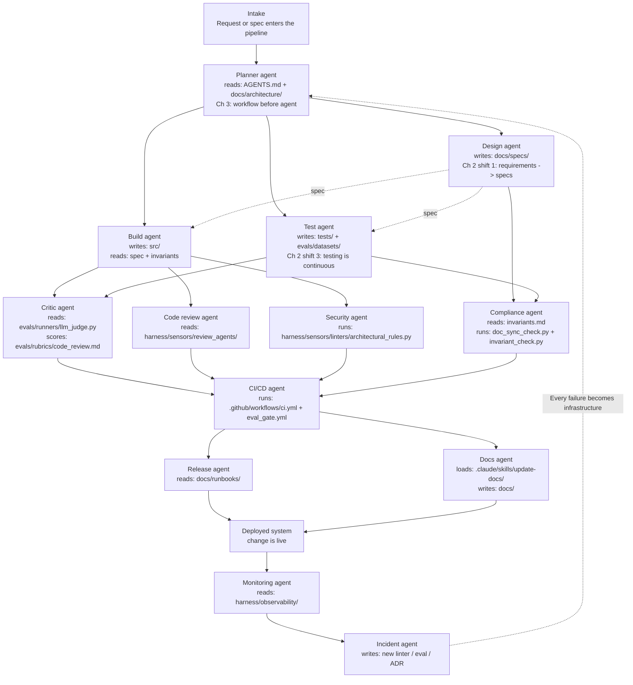

# Multi-Agent Orchestration

This repository is intentionally small, but the harness is designed to show how
multi-agent software delivery can be represented directly in version control.

## Why This Exists

The workshop argument is not just that agents can write code. It is that teams
move up a level and start engineering the environment where specialized agents
work together safely.

This file makes that orchestration explicit:
- which agent exists
- which repo artifacts it reads
- which repo artifacts it writes
- which workshop principle the agent demonstrates

## Repo-Native Flow

## Agent Map

| Agent | Reads | Writes | Why It Exists |
| --- | --- | --- | --- |
| Planner | `AGENTS.md`, `docs/architecture/overview.md`, `docs/architecture/invariants.md` | Ephemeral task decomposition | Grounds all work in the root guide before specialized agents act. |
| Design | `docs/specs/template.md` | `docs/specs/001-hello-endpoint.md` or future spec files | Turns requirements into executable specs. |
| Build | `docs/specs/001-hello-endpoint.md`, `docs/architecture/invariants.md` | `src/` | Generates product code inside declared constraints. |
| Test | `docs/specs/001-hello-endpoint.md`, `docs/architecture/invariants.md` | `tests/`, `evals/datasets/spec_compliance.jsonl` | Keeps validation continuous rather than deferred. |
| Critic | `evals/runners/llm_judge.py`, `evals/rubrics/code_review.md` | Review output or scorecard | Makes the actor-critic loop explicit. |
| Code review | `harness/sensors/review_agents/architectural_reviewer.md` | Review findings | Checks whether the change still matches the harness design. |
| Security | `harness/sensors/linters/architectural_rules.py` | Deterministic pass or fail signal | Encodes hard architectural prohibitions. |
| Compliance | `docs/architecture/invariants.md`, `harness/sensors/linters/doc_sync_check.py`, `harness/sensors/drift_detectors/invariant_check.py` | Deterministic pass or fail signal | Shows deterministic compliance over prompt-only compliance. |
| CI/CD | `.github/workflows/ci.yml`, `.github/workflows/eval_gate.yml`, `harness/tools/sandboxes/test_runner.sh` | Workflow results | Promotes tests and evals into merge-blocking gates. |
| Release | `docs/runbooks/deploy.md`, `docs/runbooks/rollback.md` | Deployment action or checklist completion | Shows docs as agent operating context, not passive reference text. |
| Docs | `.claude/skills/update-docs/SKILL.md`, `docs/validation/traceability-matrix.md` | `docs/`, ADRs, traceability updates | Makes the skills layer visible in the repo. |
| Monitoring | `harness/observability/logs_config.yaml`, `harness/observability/trace_schema.json` | Observability signal | Makes the post-deploy feedback surface explicit. |
| Incident | Existing traces, eval failures, or drift findings | New files in `harness/sensors/`, `evals/datasets/`, `docs/architecture/decisions/` | Compounds the harness after failure instead of only patching prompts. |

## What To Show In The Workshop

1. Open this file and explain the flow from planner to incident.
2. Jump from each node to the real file path it references.
3. Run `./harness/tools/sandboxes/run_demo_pipeline.sh --scenario happy`.
4. Open `harness/observability/demo_runs/latest_pipeline_trace.json`.
5. Run `./harness/tools/sandboxes/run_demo_pipeline.sh --scenario incident`.
6. Emphasize the final feedback edge: incidents enrich the repo before the
   next planning pass.

## The Point

The repo is not only storing code. It is storing the operating contracts
between specialized agents.
